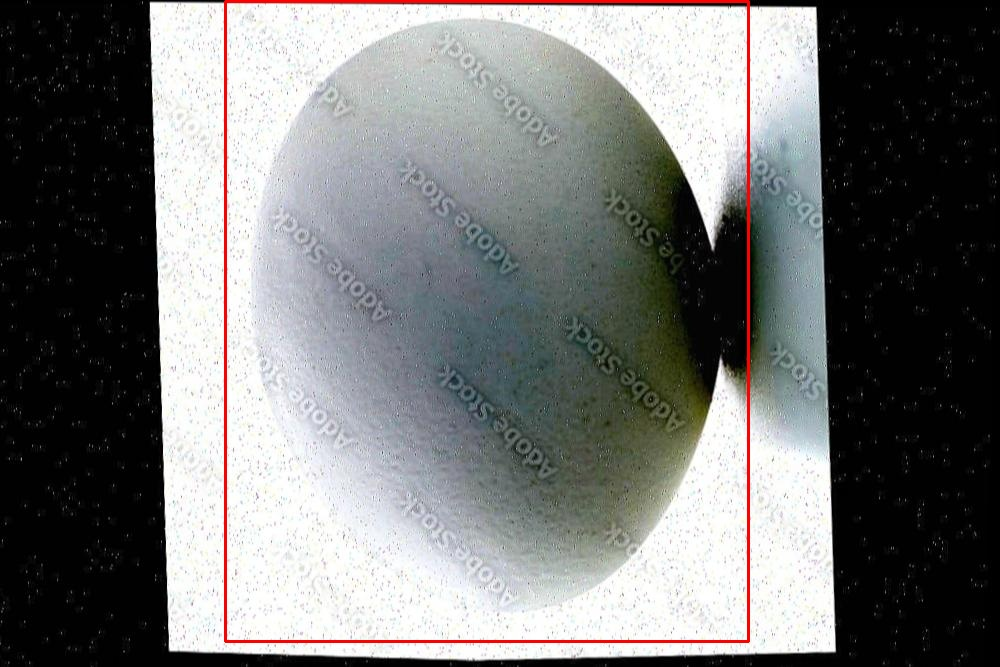

# 鸡蛋检测检测系统源码分享
 # [一条龙教学YOLOV8标注好的数据集一键训练_70+全套改进创新点发刊_Web前端展示]

### 1.研究背景与意义

项目参考[AAAI Association for the Advancement of Artificial Intelligence](https://gitee.com/qunmasj/projects)

项目来源[AACV Association for the Advancement of Computer Vision](https://github.com/qunshansj/good)

研究背景与意义

随着全球人口的不断增长，食品安全和农业生产效率日益成为社会关注的焦点。在众多农业产品中，鸡蛋作为一种重要的营养来源，广泛应用于人类饮食中。鸡蛋的质量直接影响到消费者的健康和安全，因此，如何高效、准确地对鸡蛋进行检测和分类，成为了现代农业生产中亟待解决的问题。传统的鸡蛋检测方法多依赖人工检查，不仅效率低下，而且容易受到人为因素的影响，导致检测结果的不准确性。因此，开发一种基于计算机视觉和深度学习的自动化鸡蛋检测系统显得尤为重要。

近年来，深度学习技术的快速发展为物体检测领域带来了革命性的变化。YOLO（You Only Look Once）系列模型因其高效的实时检测能力和较高的准确率，成为了物体检测任务中的热门选择。YOLOv8作为该系列的最新版本，进一步提升了模型的性能和适用性。然而，针对特定应用场景的改进仍然是提高检测精度和效率的关键。因此，基于改进YOLOv8的鸡蛋检测系统的研究，旨在通过对模型进行优化，提升其在鸡蛋检测任务中的表现。

本研究所使用的数据集包含4025张图像，涵盖了两类目标：鸡蛋及其分类。这一数据集的构建为模型的训练和评估提供了丰富的样本基础，能够有效支持模型在不同环境和条件下的泛化能力。通过对这些图像进行标注和处理，研究者能够提取出鸡蛋的特征信息，进而为模型的训练提供必要的数据支持。此外，数据集的多样性和丰富性也为模型的鲁棒性提供了保障，使其能够在实际应用中应对不同的挑战。

在实际应用中，基于改进YOLOv8的鸡蛋检测系统不仅可以提高检测的准确性和效率，还能够降低人工成本，提升生产线的自动化水平。这一系统的推广应用，将有助于提升鸡蛋生产的质量控制水平，确保消费者能够获得安全、优质的鸡蛋产品。同时，该系统的成功实施也为其他农产品的自动化检测提供了借鉴，推动了农业智能化的发展。

综上所述，基于改进YOLOv8的鸡蛋检测系统的研究具有重要的理论价值和实际意义。它不仅为深度学习在农业领域的应用提供了新的思路和方法，也为提升食品安全和农业生产效率贡献了力量。通过本研究，期望能够为鸡蛋检测技术的发展提供新的视角，推动农业现代化进程，最终实现食品安全与农业可持续发展的目标。

### 2.图片演示


##### 注意：由于此博客编辑较早，上面“2.图片演示”和“3.视频演示”展示的系统图片或者视频可能为老版本，新版本在老版本的基础上升级如下：（实际效果以升级的新版本为准）

  （1）适配了YOLOV8的“目标检测”模型和“实例分割”模型，通过加载相应的权重（.pt）文件即可自适应加载模型。

  （2）支持“图片识别”、“视频识别”、“摄像头实时识别”三种识别模式。

  （3）支持“图片识别”、“视频识别”、“摄像头实时识别”三种识别结果保存导出，解决手动导出（容易卡顿出现爆内存）存在的问题，识别完自动保存结果并导出到tempDir中。

  （4）支持Web前端系统中的标题、背景图等自定义修改，后面提供修改教程。

  另外本项目提供训练的数据集和训练教程,暂不提供权重文件（best.pt）,需要您按照教程进行训练后实现图片演示和Web前端界面演示的效果。

### 3.视频演示

[3.1 视频演示](https://www.bilibili.com/video/BV1qQHverE5T/?vd_source=ff015de2d29cbe2a9cdbfa7064407a08)

### 4.数据集信息展示

数据集信息展示

在本研究中，我们采用了名为“new batch”的数据集，以改进YOLOv8模型在鸡蛋检测系统中的表现。该数据集专门针对鸡蛋这一特定类别进行了精心构建，旨在为深度学习模型提供高质量的训练样本，以提高其在实际应用中的准确性和鲁棒性。数据集的类别数量为1，具体类别列表中仅包含“egg”这一项，这一设计使得模型能够专注于鸡蛋的特征提取和识别，从而减少了多类别检测带来的复杂性和潜在的混淆。

“new batch”数据集的构建过程涉及多个环节，包括数据采集、标注和预处理。首先，数据采集阶段从不同的环境和场景中收集了大量鸡蛋的图像。这些图像不仅包括了不同种类和颜色的鸡蛋，还涵盖了多种拍摄角度和光照条件，以确保数据集的多样性和代表性。通过这种方式，我们能够模拟真实世界中可能遇到的各种情况，从而提高模型的泛化能力。

在数据标注阶段，专业的标注团队对收集到的图像进行了细致的标注工作。每一张图像中的鸡蛋都被准确地框选出来，并标注为“egg”类别。这一过程不仅确保了数据的准确性，还为后续的模型训练提供了可靠的基础。标注的准确性直接影响到模型的学习效果，因此我们在标注过程中采用了严格的质量控制措施，以确保每一张图像的标注都符合标准。

数据预处理是数据集构建中的另一个重要环节。在这一阶段，我们对图像进行了多种处理，包括图像缩放、归一化和数据增强等。通过图像缩放，我们将所有图像调整为统一的尺寸，以便于模型的输入。同时，归一化处理确保了图像数据的分布均匀，减少了训练过程中的不稳定性。此外，数据增强技术如随机裁剪、旋转和颜色变换等被广泛应用，以增加数据集的多样性，防止模型过拟合。这些预处理步骤不仅提高了数据集的质量，也为模型的训练提供了更为丰富的样本。

在训练过程中，YOLOv8模型将利用“new batch”数据集进行学习。通过对鸡蛋这一单一类别的深入学习，模型将能够提取出鸡蛋的特征，如形状、颜色和纹理等。这种针对性的训练方式有助于提高模型在鸡蛋检测任务中的准确性和效率，尤其是在复杂背景和不同光照条件下的表现。

总之，“new batch”数据集为改进YOLOv8的鸡蛋检测系统提供了坚实的基础。通过精心的构建和处理，该数据集不仅具备了高质量的样本，还涵盖了丰富的多样性，确保了模型在实际应用中的有效性和可靠性。随着模型的不断训练和优化，我们期待能够实现更高的检测精度，为鸡蛋的自动化检测和分类提供强有力的技术支持。





### 5.全套项目环境部署视频教程（零基础手把手教学）

[5.1 环境部署教程链接（零基础手把手教学）](https://www.ixigua.com/7404473917358506534?logTag=c807d0cbc21c0ef59de5)


[5.2 安装Python虚拟环境创建和依赖库安装视频教程链接（零基础手把手教学）](https://www.ixigua.com/7404474678003106304?logTag=1f1041108cd1f708b01a)

### 6.手把手YOLOV8训练视频教程（零基础小白有手就能学会）

[6.1 环境部署教程链接（零基础手把手教学）](https://www.ixigua.com/7404477157818401292?logTag=d31a2dfd1983c9668658)

### 7.70+种全套YOLOV8创新点代码加载调参视频教程（一键加载写好的改进模型的配置文件）

[7.1 环境部署教程链接（零基础手把手教学）](https://www.ixigua.com/7404478314661806627?logTag=29066f8288e3f4eea3a4)

### 8.70+种全套YOLOV8创新点原理讲解（非科班也可以轻松写刊发刊，V10版本正在科研待更新）

由于篇幅限制，每个创新点的具体原理讲解就不一一展开，具体见下列网址中的创新点对应子项目的技术原理博客网址【Blog】：


[8.1 70+种全套YOLOV8创新点原理讲解链接](https://gitee.com/qunmasj/good)

### 9.系统功能展示（检测对象为举例，实际内容以本项目数据集为准）

图9.1.系统支持检测结果表格显示

  图9.2.系统支持置信度和IOU阈值手动调节

  图9.3.系统支持自定义加载权重文件best.pt(需要你通过步骤5中训练获得)

  图9.4.系统支持摄像头实时识别

  图9.5.系统支持图片识别

  图9.6.系统支持视频识别

  图9.7.系统支持识别结果文件自动保存

  图9.8.系统支持Excel导出检测结果数据


### 10.原始YOLOV8算法原理

原始YOLOv8算法原理

YOLOv8算法是目标检测领域的一项重要进展，它在YOLO系列模型的基础上进行了多项创新和优化，旨在提升目标检测的速度和准确性。YOLOv8s模型的架构由三个主要部分组成：Backbone、Neck和Head，每个部分都在特征提取和目标检测的过程中发挥着至关重要的作用。

在Backbone部分，YOLOv8s采用了CSPDarknet（Cross Stage Partial Darknet）结构，这一结构的设计理念是通过将网络分为两个部分来提高特征提取的效率。每个部分都包含多个残差块，这些残差块通过跳跃连接有效地缓解了深层网络训练中的梯度消失问题。与前代模型YOLOv5相比，YOLOv8s引入了C2f模块来替代C3模块。C2f模块的创新之处在于它将输入的特征图分成两个分支，分别经过卷积层进行降维处理。这样的设计不仅提升了特征图的维度，还通过堆叠多个分支，形成了更高维度的特征图，从而为后续的特征融合提供了丰富的信息。

在特征提取的过程中，YOLOv8s还引入了快速空间金字塔池化（SPPF）结构。这一结构的主要功能是提取不同尺度的特征，能够有效减少模型的参数量和计算量，同时提高特征提取的效率。通过这种方式，YOLOv8s能够在保持高效性的同时，捕捉到图像中各个尺度的目标特征，从而增强模型的鲁棒性。

接下来，在Neck部分，YOLOv8s采用了特征金字塔网络（FPN）和路径聚合网络（PAN）的组合结构。这一结构通过多个卷积层和池化层，对特征图进行处理和压缩，进一步提升了特征的表达能力。FPN的设计使得模型能够在不同的层次上进行特征融合，从而有效地利用多尺度信息，而PAN则通过路径聚合的方式，增强了特征的传递和融合效果。这种特征融合的策略使得YOLOv8s在目标检测任务中能够更好地捕捉到目标的上下文信息，提高了检测的准确性。

在Head部分，YOLOv8s采用了一种无锚框（Anchor-Free）的检测方式。这一创新使得模型能够直接预测目标的中心点和宽高比例，避免了传统锚框方法中需要预定义锚框的复杂性。无锚框的设计不仅减少了锚框的数量，还显著提高了检测速度和准确度。通过这种方式，YOLOv8s能够更灵活地适应不同场景和目标的变化，进一步提升了模型的实用性。

值得一提的是，YOLOv8s在模型设置上也提供了更大的灵活性。通过调整depth_factor、width_factor和ratio等参数，用户可以根据具体需求来定制模型的深度和宽度。这种灵活性使得YOLOv8s能够在不同的硬件环境下进行优化，满足各种应用场景的需求。

总的来说，YOLOv8算法在原有YOLO系列的基础上，通过引入CSPDarknet、C2f模块、SPPF结构、FPN和PAN等多项创新，极大地提升了目标检测的性能。其无锚框的检测方式不仅简化了模型的设计，还提高了检测的效率和准确性。这些改进使得YOLOv8s成为当前目标检测领域中最为先进和流行的模型之一，广泛应用于自动驾驶、安防监控、无人机视觉等多个领域。随着技术的不断进步，YOLOv8的潜力和应用前景将更加广阔，必将在未来的研究和实践中发挥重要作用。


### 11.项目核心源码讲解（再也不用担心看不懂代码逻辑）

#### 11.1 ultralytics\utils\plotting.py

以下是对给定代码的核心部分进行分析和注释。为了简化代码并保留最重要的功能，以下代码只保留了 `Colors` 和 `Annotator` 类，并添加了详细的中文注释。

```python
import numpy as np
from PIL import Image, ImageDraw, ImageFont

class Colors:
    """
    颜色类，用于处理颜色调色板。
    包含将十六进制颜色代码转换为RGB值的方法。
    """

    def __init__(self):
        """初始化颜色调色板，使用预定义的十六进制颜色。"""
        hexs = (
            "FF3838", "FF9D97", "FF701F", "FFB21D", "CFD231",
            "48F90A", "92CC17", "3DDB86", "1A9334", "00D4BB",
            "2C99A8", "00C2FF", "344593", "6473FF", "0018EC",
            "8438FF", "520085", "CB38FF", "FF95C8", "FF37C7",
        )
        # 将十六进制颜色转换为RGB并存储
        self.palette = [self.hex2rgb(f"#{c}") for c in hexs]
        self.n = len(self.palette)  # 颜色数量

    def __call__(self, i, bgr=False):
        """根据索引返回颜色，支持BGR格式。"""
        c = self.palette[int(i) % self.n]  # 获取颜色
        return (c[2], c[1], c[0]) if bgr else c  # 返回BGR或RGB格式

    @staticmethod
    def hex2rgb(h):
        """将十六进制颜色代码转换为RGB值。"""
        return tuple(int(h[1 + i : 1 + i + 2], 16) for i in (0, 2, 4))


class Annotator:
    """
    注释类，用于在图像上绘制框、文本和关键点。
    """

    def __init__(self, im, line_width=None, font_size=None, font="Arial.ttf", pil=False):
        """初始化Annotator类，设置图像和绘制参数。"""
        self.im = im if isinstance(im, Image.Image) else Image.fromarray(im)  # 转换为PIL图像
        self.draw = ImageDraw.Draw(self.im)  # 创建绘图对象
        self.lw = line_width or 2  # 线宽
        self.font = ImageFont.load_default()  # 使用默认字体

    def box_label(self, box, label="", color=(128, 128, 128), txt_color=(255, 255, 255)):
        """在图像上绘制带标签的矩形框。"""
        p1 = (box[0], box[1])  # 矩形框左上角
        p2 = (box[2], box[3])  # 矩形框右下角
        self.draw.rectangle(box, width=self.lw, outline=color)  # 绘制矩形框
        if label:
            w, h = self.draw.textsize(label, font=self.font)  # 获取文本尺寸
            self.draw.rectangle((p1[0], p1[1] - h, p1[0] + w + 1, p1[1] + 1), fill=color)  # 绘制标签背景
            self.draw.text((p1[0], p1[1] - h), label, fill=txt_color, font=self.font)  # 绘制标签文本

    def kpts(self, kpts, radius=5):
        """在图像上绘制关键点。"""
        for k in kpts:
            x, y = int(k[0]), int(k[1])  # 获取关键点坐标
            self.draw.ellipse((x - radius, y - radius, x + radius, y + radius), fill=(255, 0, 0))  # 绘制关键点

    def result(self):
        """返回注释后的图像。"""
        return np.asarray(self.im)  # 转换为numpy数组并返回
```

### 代码说明：
1. **Colors 类**：
   - 该类用于管理颜色调色板，支持将十六进制颜色转换为RGB格式。
   - `__call__` 方法允许通过索引直接获取颜色，支持BGR格式。

2. **Annotator 类**：
   - 该类用于在图像上绘制矩形框、文本和关键点。
   - `box_label` 方法绘制带标签的矩形框，支持自定义颜色和文本。
   - `kpts` 方法绘制关键点，使用圆形表示。

### 重要性：
- 这两个类是进行图像注释的核心，提供了基本的绘图功能，能够在目标检测和图像处理任务中有效地展示结果。

该文件 `ultralytics/utils/plotting.py` 是一个用于可视化和绘制图像的工具类，主要用于处理与 Ultralytics YOLO 相关的图像标注和绘图功能。文件中包含多个类和函数，以下是对其主要内容的逐步分析。

首先，文件导入了一些必要的库，包括 `cv2`、`matplotlib`、`numpy`、`torch` 和 `PIL`，这些库为图像处理和绘图提供了支持。接着，定义了一个 `Colors` 类，该类用于管理颜色调色板，包括将十六进制颜色代码转换为 RGB 值。该类的构造函数初始化了一组颜色，并提供了颜色转换的方法。

接下来是 `Annotator` 类，它是该文件的核心部分，负责在图像上绘制各种标注。该类的构造函数接受图像、线宽、字体等参数，并根据这些参数初始化绘图所需的属性。`Annotator` 类中包含多个方法，例如 `box_label` 用于绘制边界框和标签，`masks` 用于在图像上绘制掩码，`kpts` 用于绘制关键点，`rectangle` 和 `text` 方法用于绘制矩形和文本。

`box_label` 方法根据给定的边界框和标签在图像上绘制矩形框，并根据是否使用 PIL 或 OpenCV 选择不同的绘制方式。`masks` 方法用于将预测的掩码绘制到图像上，支持透明度设置。`kpts` 方法用于绘制关键点，并可以选择是否连接关键点以表示人体姿态。

文件中还定义了一些辅助函数，例如 `plot_labels` 用于绘制训练标签的直方图和统计信息，`save_one_box` 用于根据边界框保存图像的裁剪部分，`plot_images` 用于绘制图像网格并标注类别和边界框。

此外，文件还提供了 `plot_results` 函数，用于从 CSV 文件中绘制训练结果，支持分割、姿态估计和分类等多种类型的数据。`plt_color_scatter` 和 `plot_tune_results` 函数用于绘制超参数调优结果和散点图。

最后，文件中还包含一些用于将模型输出转换为目标格式的函数，例如 `output_to_target` 和 `output_to_rotated_target`，这些函数将模型的输出格式化为便于绘图的形式。

总的来说，该文件提供了一整套用于图像标注、绘图和结果可视化的工具，方便用户在使用 Ultralytics YOLO 进行目标检测和其他计算机视觉任务时进行结果分析和展示。

#### 11.2 ui.py

```python
import sys
import subprocess

def run_script(script_path):
    """
    使用当前 Python 环境运行指定的脚本。

    Args:
        script_path (str): 要运行的脚本路径

    Returns:
        None
    """
    # 获取当前 Python 解释器的路径
    python_path = sys.executable

    # 构建运行命令，使用 streamlit 运行指定的脚本
    command = f'"{python_path}" -m streamlit run "{script_path}"'

    # 执行命令
    result = subprocess.run(command, shell=True)
    # 检查命令执行结果，如果返回码不为0，表示执行出错
    if result.returncode != 0:
        print("脚本运行出错。")

# 实例化并运行应用
if __name__ == "__main__":
    # 指定要运行的脚本路径
    script_path = "web.py"  # 这里可以直接指定脚本名称

    # 调用函数运行脚本
    run_script(script_path)
```

### 代码注释说明：
1. **导入模块**：
   - `sys`：用于获取当前 Python 解释器的路径。
   - `subprocess`：用于执行外部命令。

2. **定义 `run_script` 函数**：
   - 该函数接受一个参数 `script_path`，表示要运行的 Python 脚本的路径。
   - 使用 `sys.executable` 获取当前 Python 解释器的路径。
   - 构建一个命令字符串，用于运行 `streamlit`，并将指定的脚本作为参数传入。
   - 使用 `subprocess.run` 执行构建的命令，并检查返回码以判断脚本是否成功运行。

3. **主程序块**：
   - 在主程序中，指定要运行的脚本路径（这里直接使用 `"web.py"`）。
   - 调用 `run_script` 函数，传入脚本路径以执行该脚本。

这个程序文件名为 `ui.py`，主要功能是通过当前的 Python 环境来运行一个指定的脚本。代码中首先导入了必要的模块，包括 `sys`、`os` 和 `subprocess`，以及一个自定义的路径处理模块 `abs_path`。

在 `run_script` 函数中，首先获取当前 Python 解释器的路径，这样可以确保使用正确的 Python 环境来执行脚本。接着，构建一个命令字符串，该命令用于运行指定的脚本 `script_path`，并使用 `streamlit` 模块来启动该脚本。`streamlit` 是一个用于构建数据应用的库。

然后，使用 `subprocess.run` 方法来执行构建好的命令。这个方法会在一个新的 shell 中运行命令，并等待其完成。如果命令执行的返回码不为零，表示脚本运行出错，程序会输出相应的错误信息。

在文件的最后部分，使用 `if __name__ == "__main__":` 语句来确保只有在直接运行该文件时才会执行后面的代码。在这里，指定了要运行的脚本路径为 `web.py`，并调用 `run_script` 函数来执行这个脚本。

总体来说，这个程序的主要目的是为了方便地运行一个名为 `web.py` 的脚本，并确保在当前的 Python 环境中执行。

#### 11.3 ultralytics\engine\validator.py

以下是经过简化并注释的核心代码部分，主要集中在 `BaseValidator` 类的实现上。这个类用于验证 YOLO 模型的性能。

```python
import json
import time
from pathlib import Path
import numpy as np
import torch
from ultralytics.cfg import get_cfg, get_save_dir
from ultralytics.utils import LOGGER, TQDM, callbacks, select_device, smart_inference_mode

class BaseValidator:
    """
    BaseValidator类用于验证YOLO模型的性能。
    """

    def __init__(self, dataloader=None, save_dir=None, pbar=None, args=None, _callbacks=None):
        """
        初始化BaseValidator实例。

        参数:
            dataloader (DataLoader): 用于验证的数据加载器。
            save_dir (Path): 结果保存目录。
            pbar (tqdm): 进度条。
            args (SimpleNamespace): 验证器的配置。
            _callbacks (dict): 回调函数字典。
        """
        self.args = get_cfg(overrides=args)  # 获取配置
        self.dataloader = dataloader  # 数据加载器
        self.save_dir = save_dir or get_save_dir(self.args)  # 保存目录
        self.speed = {"preprocess": 0.0, "inference": 0.0, "loss": 0.0, "postprocess": 0.0}  # 速度统计
        self.callbacks = _callbacks or callbacks.get_default_callbacks()  # 回调函数

    @smart_inference_mode()
    def __call__(self, trainer=None, model=None):
        """
        执行验证过程。
        如果传入了训练器，则验证训练中的模型；否则验证预训练模型。
        """
        self.training = trainer is not None  # 判断是否在训练模式
        if self.training:
            self.device = trainer.device  # 获取设备
            model = trainer.model.half() if self.args.half else trainer.model.float()  # 设置模型精度
            model.eval()  # 设置模型为评估模式
        else:
            model = self.load_model(model)  # 加载模型
            self.dataloader = self.get_dataloader(self.args.data, self.args.batch)  # 获取数据加载器
            model.eval()  # 设置模型为评估模式

        self.run_validation(model)  # 运行验证过程

    def load_model(self, model):
        """加载模型并返回。"""
        # 这里省略具体实现
        return model

    def run_validation(self, model):
        """执行验证过程，计算并更新指标。"""
        bar = TQDM(self.dataloader, desc="Validating", total=len(self.dataloader))  # 进度条
        for batch_i, batch in enumerate(bar):
            preds = model(batch["img"])  # 模型推理
            self.update_metrics(preds, batch)  # 更新指标

        stats = self.get_stats()  # 获取统计信息
        self.print_results(stats)  # 打印结果

    def update_metrics(self, preds, batch):
        """根据预测结果和批次更新指标。"""
        # 这里省略具体实现

    def get_stats(self):
        """返回模型性能的统计信息。"""
        return {}

    def print_results(self, stats):
        """打印模型预测的结果。"""
        LOGGER.info(f"Validation Results: {stats}")  # 打印结果
```

### 代码注释说明：
1. **类的定义**：`BaseValidator` 类是用于验证 YOLO 模型性能的基类，包含了初始化和验证过程的主要逻辑。
2. **初始化方法**：在构造函数中，设置了验证所需的参数和配置，包括数据加载器、保存目录和回调函数。
3. **调用方法**：`__call__` 方法是执行验证的入口，判断当前是训练模式还是验证模式，并根据情况加载模型和数据。
4. **模型加载**：`load_model` 方法用于加载模型，具体实现省略。
5. **验证过程**：`run_validation` 方法中，使用进度条显示验证进度，并在每个批次中进行推理和指标更新。
6. **指标更新**：`update_metrics` 方法用于更新模型的性能指标，具体实现省略。
7. **统计信息**：`get_stats` 方法返回模型的统计信息，`print_results` 方法打印这些结果。

通过这样的注释，代码的核心逻辑和功能得以清晰展现，便于理解和维护。

这个程序文件是一个用于验证YOLO模型（You Only Look Once）准确性的类，主要功能是检查模型在数据集的测试或验证集上的表现。文件中定义了一个名为`BaseValidator`的类，该类为创建验证器提供了基础结构和方法。

在类的初始化方法中，首先通过`get_cfg`函数获取配置，并设置数据加载器、保存目录、进度条等参数。然后，它会根据传入的参数检查图像大小，并确保保存目录存在。类中还定义了一些属性，用于记录验证过程中的各种状态和统计信息，比如当前批次索引、设备类型、类别名称、混淆矩阵等。

`__call__`方法是类的核心，支持对预训练模型或正在训练的模型进行验证。根据传入的参数，方法会判断当前是训练模式还是验证模式，并相应地设置设备、数据和模型。它会初始化性能指标，创建进度条，并在每个批次中执行预处理、推理、损失计算和后处理等步骤。在每个批次结束后，更新指标并进行可视化。如果在训练模式下，还会返回损失值；在验证模式下，会保存预测结果到JSON文件中。

`match_predictions`方法用于将预测结果与真实标签进行匹配，基于IoU（Intersection over Union）值来判断预测的准确性。该方法支持使用SciPy库进行更精确的匹配。

此外，类中还定义了一些用于回调的函数，如`add_callback`和`run_callbacks`，这些函数可以在验证过程中的特定事件触发时执行自定义操作。`get_dataloader`和`build_dataset`方法则是抽象方法，需在子类中实现，以便根据具体的数据集构建数据加载器。

类中还包含了一些占位符方法，如`init_metrics`、`update_metrics`、`finalize_metrics`等，这些方法需要在具体实现中定义，以便进行性能指标的初始化、更新和最终化。

总的来说，这个文件为YOLO模型的验证提供了一个结构化的框架，允许用户在不同的模式下进行模型性能评估，并通过回调机制支持灵活的扩展和定制。

#### 11.4 train.py

以下是经过简化和注释的核心代码部分：

```python
import os
import torch
import yaml
from ultralytics import YOLO  # 导入YOLO模型库
from QtFusion.path import abs_path  # 导入路径处理工具

# 设置设备为GPU（如果可用），否则使用CPU
device = "0" if torch.cuda.is_available() else "cpu"

if __name__ == '__main__':  # 确保该模块被直接运行时才执行以下代码
    # 设置训练参数
    workers = 1  # 数据加载的工作进程数
    batch = 2    # 每个批次的样本数

    # 数据集名称
    data_name = "data"
    # 获取数据集配置文件的绝对路径
    data_path = abs_path(f'datasets/{data_name}/{data_name}.yaml', path_type='current')
    
    # 获取数据集目录路径
    directory_path = os.path.dirname(data_path)
    
    # 读取YAML配置文件
    with open(data_path, 'r') as file:
        data = yaml.load(file, Loader=yaml.FullLoader)
    
    # 如果YAML文件中包含'path'项，则修改为当前目录路径
    if 'path' in data:
        data['path'] = directory_path
        # 将修改后的数据写回YAML文件
        with open(data_path, 'w') as file:
            yaml.safe_dump(data, file, sort_keys=False)

    # 加载YOLOv8模型配置
    model = YOLO(model='./ultralytics/cfg/models/v8/yolov8s.yaml', task='detect')
    
    # 开始训练模型
    results2 = model.train(
        data=data_path,  # 指定训练数据的配置文件路径
        device=device,  # 指定使用的设备
        workers=workers,  # 数据加载的工作进程数
        imgsz=640,  # 输入图像的大小
        epochs=100,  # 训练的轮数
        batch=batch,  # 每个批次的样本数
        name='train_v8_' + data_name  # 训练任务的名称
    )
```

### 代码注释说明：
1. **导入必要的库**：导入了处理文件路径、YAML文件、YOLO模型的相关库。
2. **设备选择**：根据是否有可用的GPU选择训练设备。
3. **数据集配置**：设置数据集名称，并获取相应的YAML配置文件的绝对路径。
4. **读取和修改YAML文件**：读取YAML文件内容，修改其中的路径项，并将修改后的内容写回文件。
5. **模型加载**：加载YOLOv8模型的配置文件。
6. **模型训练**：调用模型的训练方法，传入训练所需的参数，包括数据路径、设备、工作进程数、图像大小、训练轮数和批次大小。

这个程序文件 `train.py` 是一个用于训练 YOLOv8 模型的脚本。首先，它导入了必要的库，包括 `os`、`torch`、`yaml` 和 `ultralytics` 中的 YOLO 模型。接着，它通过检查是否有可用的 GPU 来决定使用 CPU 还是 GPU 进行训练。

在 `if __name__ == '__main__':` 语句下，程序开始执行主要的训练逻辑。首先，它定义了工作进程的数量和批次大小。然后，指定了数据集的名称，这里使用的是 `"data"`，并构建了数据集 YAML 文件的绝对路径。通过 `abs_path` 函数，程序将相对路径转换为绝对路径，并将路径中的分隔符统一为 UNIX 风格。

接下来，程序获取数据集 YAML 文件所在的目录路径，并打开该文件以读取内容。使用 `yaml` 库，程序加载 YAML 文件的内容，并检查其中是否包含 `path` 项。如果存在，程序将其值修改为数据集的目录路径，并将修改后的内容写回到 YAML 文件中，以确保后续的训练能够正确找到数据集。

随后，程序加载了预训练的 YOLOv8 模型，指定了模型的配置文件路径。接着，调用 `model.train()` 方法开始训练模型。在训练过程中，程序指定了多个参数，包括数据配置文件的路径、使用的设备、工作进程数量、输入图像的大小（640x640）、训练的 epoch 数量（100），以及训练任务的名称（以 `train_v8_` 开头并附加数据集名称）。

整个程序的结构清晰，主要集中在数据集的准备和模型的训练过程，适合用于目标检测任务的训练。

#### 11.5 ultralytics\models\utils\loss.py

以下是经过简化和注释的核心代码部分，主要集中在 `DETRLoss` 类及其关键方法上：

```python
import torch
import torch.nn as nn
import torch.nn.functional as F
from ultralytics.utils.loss import FocalLoss, VarifocalLoss
from ultralytics.utils.metrics import bbox_iou
from .ops import HungarianMatcher

class DETRLoss(nn.Module):
    """
    DETR (DEtection TRansformer) 损失类。该类计算并返回DETR目标检测模型的不同损失组件。
    包括分类损失、边界框损失、GIoU损失，以及可选的辅助损失。
    """

    def __init__(self, nc=80, loss_gain=None, aux_loss=True, use_fl=True, use_vfl=False):
        """
        初始化DETR损失函数。

        参数:
            nc (int): 类别数量。
            loss_gain (dict): 各损失组件的系数。
            aux_loss (bool): 是否计算辅助损失。
            use_fl (bool): 是否使用FocalLoss。
            use_vfl (bool): 是否使用VarifocalLoss。
        """
        super().__init__()

        # 设置损失增益的默认值
        if loss_gain is None:
            loss_gain = {"class": 1, "bbox": 5, "giou": 2}
        self.nc = nc  # 类别数量
        self.matcher = HungarianMatcher(cost_gain={"class": 2, "bbox": 5, "giou": 2})  # 匹配器
        self.loss_gain = loss_gain  # 损失增益
        self.aux_loss = aux_loss  # 是否使用辅助损失
        self.fl = FocalLoss() if use_fl else None  # Focal损失
        self.vfl = VarifocalLoss() if use_vfl else None  # Varifocal损失
        self.device = None  # 设备

    def _get_loss_class(self, pred_scores, targets, gt_scores, num_gts):
        """计算分类损失。"""
        bs, nq = pred_scores.shape[:2]  # 获取批次大小和查询数量
        one_hot = torch.zeros((bs, nq, self.nc + 1), dtype=torch.int64, device=targets.device)  # 创建one-hot编码
        one_hot.scatter_(2, targets.unsqueeze(-1), 1)  # 填充one-hot编码
        one_hot = one_hot[..., :-1]  # 去掉最后一类（背景类）
        gt_scores = gt_scores.view(bs, nq, 1) * one_hot  # 计算真实得分

        # 使用Focal损失或Varifocal损失
        if self.fl:
            if num_gts and self.vfl:
                loss_cls = self.vfl(pred_scores, gt_scores, one_hot)
            else:
                loss_cls = self.fl(pred_scores, one_hot.float())
            loss_cls /= max(num_gts, 1) / nq  # 标准化损失
        else:
            loss_cls = nn.BCEWithLogitsLoss(reduction="none")(pred_scores, gt_scores).mean(1).sum()  # 二元交叉熵损失

        return {"loss_class": loss_cls.squeeze() * self.loss_gain["class"]}  # 返回分类损失

    def _get_loss_bbox(self, pred_bboxes, gt_bboxes):
        """计算边界框损失和GIoU损失。"""
        loss = {}
        if len(gt_bboxes) == 0:  # 如果没有真实边界框
            loss["loss_bbox"] = torch.tensor(0.0, device=self.device)
            loss["loss_giou"] = torch.tensor(0.0, device=self.device)
            return loss

        # 计算L1损失和GIoU损失
        loss["loss_bbox"] = self.loss_gain["bbox"] * F.l1_loss(pred_bboxes, gt_bboxes, reduction="sum") / len(gt_bboxes)
        loss["loss_giou"] = 1.0 - bbox_iou(pred_bboxes, gt_bboxes, xywh=True, GIoU=True)
        loss["loss_giou"] = loss["loss_giou"].sum() / len(gt_bboxes)
        loss["loss_giou"] = self.loss_gain["giou"] * loss["loss_giou"]
        return {k: v.squeeze() for k, v in loss.items()}  # 返回损失

    def _get_loss(self, pred_bboxes, pred_scores, gt_bboxes, gt_cls):
        """获取总损失。"""
        match_indices = self.matcher(pred_bboxes, pred_scores, gt_bboxes, gt_cls)  # 计算匹配索引
        idx, gt_idx = self._get_index(match_indices)  # 获取索引
        pred_bboxes, gt_bboxes = pred_bboxes[idx], gt_bboxes[gt_idx]  # 获取匹配的边界框

        bs, nq = pred_scores.shape[:2]
        targets = torch.full((bs, nq), self.nc, device=pred_scores.device, dtype=gt_cls.dtype)  # 初始化目标
        targets[idx] = gt_cls[gt_idx]  # 填充目标

        gt_scores = torch.zeros([bs, nq], device=pred_scores.device)  # 初始化真实得分
        if len(gt_bboxes):
            gt_scores[idx] = bbox_iou(pred_bboxes.detach(), gt_bboxes, xywh=True).squeeze(-1)  # 计算真实得分

        loss = {}
        loss.update(self._get_loss_class(pred_scores, targets, gt_scores, len(gt_bboxes)))  # 更新分类损失
        loss.update(self._get_loss_bbox(pred_bboxes, gt_bboxes))  # 更新边界框损失
        return loss  # 返回总损失

    def forward(self, pred_bboxes, pred_scores, batch):
        """
        前向传播，计算损失。

        参数:
            pred_bboxes (torch.Tensor): 预测的边界框。
            pred_scores (torch.Tensor): 预测的得分。
            batch (dict): 包含真实信息的字典。
        """
        self.device = pred_bboxes.device  # 设置设备
        gt_cls, gt_bboxes = batch["cls"], batch["bboxes"]  # 获取真实类别和边界框

        total_loss = self._get_loss(pred_bboxes[-1], pred_scores[-1], gt_bboxes, gt_cls)  # 计算总损失
        return total_loss  # 返回总损失
```

### 代码说明：
1. **类定义**：`DETRLoss` 类用于计算DETR模型的损失，包括分类损失和边界框损失。
2. **初始化方法**：`__init__` 方法中设置了类别数量、损失增益、是否使用辅助损失等参数。
3. **损失计算方法**：
   - `_get_loss_class`：计算分类损失，使用Focal损失或二元交叉熵损失。
   - `_get_loss_bbox`：计算边界框损失和GIoU损失。
   - `_get_loss`：综合计算分类损失和边界框损失。
4. **前向传播**：`forward` 方法用于接收预测结果和真实数据，计算并返回总损失。

这个程序文件是一个用于计算DETR（DEtection TRansformer）模型损失的类，主要包括了目标检测中所需的不同损失组件，如分类损失、边界框损失、GIoU损失等。该文件定义了两个类：`DETRLoss`和`RTDETRDetectionLoss`，其中`RTDETRDetectionLoss`是对`DETRLoss`的扩展，增加了去噪训练损失的计算。

在`DETRLoss`类中，构造函数初始化了一些参数，包括类别数量、损失系数、是否使用辅助损失、是否使用Focal Loss和Varifocal Loss等。该类还创建了一个匈牙利匹配器（HungarianMatcher），用于计算匹配成本和索引。

`_get_loss_class`方法计算分类损失，首先将目标标签转换为one-hot编码，然后根据是否使用Focal Loss或Varifocal Loss来计算损失。`_get_loss_bbox`方法计算边界框损失和GIoU损失，如果没有目标框，则返回零损失。`_get_loss_aux`方法用于计算辅助损失，遍历每个解码器层的预测结果并调用损失计算方法。

`_get_loss`方法是损失计算的核心，首先通过匹配器获得匹配索引，然后根据这些索引提取预测的边界框和真实的边界框，接着计算分类损失和边界框损失。`forward`方法是类的入口，接受预测的边界框和分数，以及包含真实标签的批次数据，最终返回总损失。

`RTDETRDetectionLoss`类在`DETRLoss`的基础上添加了去噪损失的计算。它的`forward`方法在计算标准损失后，检查是否提供了去噪元数据，如果有，则计算去噪损失并将其添加到总损失中。

总的来说，这个文件实现了DETR模型的损失计算逻辑，能够有效地处理目标检测任务中的多种损失，并为后续的模型训练提供支持。

#### 11.6 ultralytics\data\converter.py

以下是代码中最核心的部分，并附上详细的中文注释：

```python
def coco91_to_coco80_class():
    """
    将91个COCO类ID转换为80个COCO类ID。

    返回:
        (list): 一个包含91个类ID的列表，其中索引表示80个类ID，值为对应的91个类ID。
    """
    return [
        0, 1, 2, 3, 4, 5, 6, 7, 8, 9, 10, None, 11, 12, 13, 14, 15, 16, 17, 18, 19, 20,
        21, 22, 23, None, 24, 25, None, None, 26, 27, 28, 29, 30, 31, 32, 33, 34, 35,
        36, 37, 38, 39, None, 40, 41, 42, 43, 44, 45, 46, 47, 48, 49, 50, 51, 52, 53,
        54, 55, 56, 57, 58, 59, None, 60, None, None, 61, None, 62, 63, 64, 65, 66, 67,
        68, 69, 70, 71, 72, None, 73, 74, 75, 76, 77, 78, 79, None,
    ]


def convert_coco(
    labels_dir="../coco/annotations/",
    save_dir="coco_converted/",
    use_segments=False,
    use_keypoints=False,
    cls91to80=True,
):
    """
    将COCO数据集的注释转换为适合训练YOLO模型的YOLO注释格式。

    参数:
        labels_dir (str, optional): 包含COCO数据集注释文件的目录路径。
        save_dir (str, optional): 保存结果的目录路径。
        use_segments (bool, optional): 是否在输出中包含分割掩码。
        use_keypoints (bool, optional): 是否在输出中包含关键点注释。
        cls91to80 (bool, optional): 是否将91个COCO类ID映射到对应的80个COCO类ID。

    输出:
        在指定的输出目录中生成输出文件。
    """

    # 创建数据集目录
    save_dir = increment_path(save_dir)  # 如果保存目录已存在，则递增
    for p in save_dir / "labels", save_dir / "images":
        p.mkdir(parents=True, exist_ok=True)  # 创建目录

    # 转换类
    coco80 = coco91_to_coco80_class()  # 获取80类ID映射

    # 导入json文件
    for json_file in sorted(Path(labels_dir).resolve().glob("*.json")):
        fn = Path(save_dir) / "labels" / json_file.stem.replace("instances_", "")  # 文件夹名称
        fn.mkdir(parents=True, exist_ok=True)
        with open(json_file) as f:
            data = json.load(f)  # 读取json数据

        # 创建图像字典
        images = {f'{x["id"]:d}': x for x in data["images"]}
        # 创建图像-注释字典
        imgToAnns = defaultdict(list)
        for ann in data["annotations"]:
            imgToAnns[ann["image_id"]].append(ann)

        # 写入标签文件
        for img_id, anns in TQDM(imgToAnns.items(), desc=f"Annotations {json_file}"):
            img = images[f"{img_id:d}"]
            h, w, f = img["height"], img["width"], img["file_name"]

            bboxes = []  # 存储边界框
            segments = []  # 存储分割
            keypoints = []  # 存储关键点
            for ann in anns:
                if ann["iscrowd"]:
                    continue  # 跳过人群注释
                # COCO框格式为[左上角x, 左上角y, 宽度, 高度]
                box = np.array(ann["bbox"], dtype=np.float64)
                box[:2] += box[2:] / 2  # 将左上角坐标转换为中心坐标
                box[[0, 2]] /= w  # 归一化x坐标
                box[[1, 3]] /= h  # 归一化y坐标
                if box[2] <= 0 or box[3] <= 0:  # 如果宽度或高度小于等于0
                    continue

                cls = coco80[ann["category_id"] - 1] if cls91to80 else ann["category_id"] - 1  # 类别
                box = [cls] + box.tolist()  # 添加类别到边界框
                if box not in bboxes:
                    bboxes.append(box)  # 添加边界框
                    if use_segments and ann.get("segmentation") is not None:
                        # 处理分割
                        if len(ann["segmentation"]) == 0:
                            segments.append([])
                            continue
                        elif len(ann["segmentation"]) > 1:
                            s = merge_multi_segment(ann["segmentation"])  # 合并多个分割
                            s = (np.concatenate(s, axis=0) / np.array([w, h])).reshape(-1).tolist()
                        else:
                            s = [j for i in ann["segmentation"] for j in i]  # 所有分割连接
                            s = (np.array(s).reshape(-1, 2) / np.array([w, h])).reshape(-1).tolist()
                        s = [cls] + s
                        segments.append(s)  # 添加分割
                    if use_keypoints and ann.get("keypoints") is not None:
                        keypoints.append(
                            box + (np.array(ann["keypoints"]).reshape(-1, 3) / np.array([w, h, 1])).reshape(-1).tolist()
                        )  # 添加关键点

            # 写入文件
            with open((fn / f).with_suffix(".txt"), "a") as file:
                for i in range(len(bboxes)):
                    if use_keypoints:
                        line = (*(keypoints[i]),)  # 类别, 边界框, 关键点
                    else:
                        line = (
                            *(segments[i] if use_segments and len(segments[i]) > 0 else bboxes[i]),
                        )  # 类别, 边界框或分割
                    file.write(("%g " * len(line)).rstrip() % line + "\n")  # 写入数据

    LOGGER.info(f"COCO数据成功转换。\n结果保存到 {save_dir.resolve()}")
```

### 代码核心部分说明：
1. **coco91_to_coco80_class**: 该函数用于将COCO数据集中91个类的ID转换为80个类的ID，返回一个映射列表。
2. **convert_coco**: 该函数负责将COCO数据集的注释转换为YOLO格式，支持选择是否包含分割和关键点信息。它会创建相应的目录，读取JSON文件，处理每个图像的注释，并将结果写入文本文件中。

这个程序文件 `ultralytics\data\converter.py` 主要用于将 COCO 数据集的标注格式转换为 YOLO 模型所需的标注格式。文件中包含多个函数，分别实现不同的功能。

首先，文件中定义了两个函数 `coco91_to_coco80_class` 和 `coco80_to_coco91_class`，它们用于在 COCO 数据集中将 91 类的标识符转换为 80 类的标识符，反之亦然。这两个函数返回一个列表，其中每个索引对应于 80 类或 91 类的标识符，列表中的值是对应的类 ID。

接下来，`convert_coco` 函数是主要的转换函数。它接受多个参数，包括标注文件的目录、保存结果的目录、是否使用分割掩码和关键点等。该函数首先创建保存结果的目录，并确保其存在。然后，它读取指定目录下的 JSON 文件，这些文件包含 COCO 数据集的标注信息。

在处理每个 JSON 文件时，函数会构建一个图像字典和一个图像-标注字典。对于每个图像，函数会提取其高度、宽度和文件名，并初始化用于存储边界框、分割和关键点的列表。然后，函数遍历与该图像相关的所有标注，转换边界框的格式，并将其归一化。转换过程中，函数还会根据需要处理分割和关键点信息。

最后，函数将转换后的数据写入文本文件中，文件名与图像文件名相同，格式符合 YOLO 的要求。转换完成后，函数会记录成功的信息。

此外，文件中还定义了 `convert_dota_to_yolo_obb` 函数，用于将 DOTA 数据集的标注转换为 YOLO 的方向边界框格式。该函数会处理 DOTA 数据集中的训练和验证图像，并将原始标签转换为 YOLO 格式。函数内部定义了一个 `convert_label` 的辅助函数，用于处理单个图像的标签转换。

最后，文件中还包含了一些辅助函数，如 `min_index` 和 `merge_multi_segment`，用于计算最短距离的索引和合并多个分割段。这些函数在处理分割信息时非常有用。

总体而言，这个程序文件实现了从 COCO 和 DOTA 数据集到 YOLO 格式的标注转换，方便用户在训练 YOLO 模型时使用。

### 12.系统整体结构（节选）

### 整体功能和构架概括

整个项目的功能主要集中在使用 YOLO（You Only Look Once）模型进行目标检测和相关任务。该项目包含多个模块，每个模块负责特定的功能，如数据处理、模型训练、损失计算、验证、可视化等。以下是各个模块的功能概述：

1. **数据处理**：负责将数据集（如 COCO 和 DOTA）转换为 YOLO 所需的格式，确保数据可以被模型正确读取和训练。
2. **模型训练**：提供训练 YOLO 模型的脚本，设置训练参数，加载数据集，并进行模型训练。
3. **损失计算**：实现目标检测模型的损失函数，计算分类损失、边界框损失等，支持不同的损失计算策略。
4. **验证**：提供验证模型性能的工具，评估模型在验证集上的表现，计算指标并生成报告。
5. **可视化**：提供可视化工具，帮助用户查看训练过程中的结果，如绘制边界框、损失曲线等。
6. **用户界面**：通过简单的用户界面运行训练脚本，方便用户操作。

### 文件功能整理表

| 文件路径                                           | 功能描述                                                     |
|--------------------------------------------------|------------------------------------------------------------|
| `ultralytics/utils/plotting.py`                 | 提供可视化工具，用于绘制图像、边界框、标签等，支持多种可视化功能。 |
| `ui.py`                                         | 运行指定的脚本（如 `web.py`），提供简单的用户界面以启动训练。   |
| `ultralytics/engine/validator.py`               | 实现模型验证的基础类，计算模型在验证集上的性能指标。         |
| `train.py`                                      | 训练 YOLO 模型的主脚本，设置训练参数并启动训练过程。         |
| `ultralytics/models/utils/loss.py`              | 计算目标检测模型的损失，包括分类损失和边界框损失等。       |
| `ultralytics/data/converter.py`                 | 将 COCO 和 DOTA 数据集的标注格式转换为 YOLO 所需的格式。     |
| `ultralytics/models/yolo/obb/train.py`          | 训练方向边界框（OBB）YOLO 模型的脚本，处理特定的训练逻辑。   |
| `ultralytics/nn/modules/transformer.py`         | 实现与 Transformer 相关的模块，可能用于模型的特征提取和处理。 |
| `ultralytics/models/sam/modules/decoders.py`    | 实现 SAM（Segment Anything Model）相关的解码器模块。         |
| `ultralytics/models/yolo/classify/val.py`       | 验证 YOLO 分类模型的性能，计算分类准确率等指标。             |

这个表格总结了每个文件的主要功能，帮助理解整个项目的结构和各个模块之间的关系。

注意：由于此博客编辑较早，上面“11.项目核心源码讲解（再也不用担心看不懂代码逻辑）”中部分代码可能会优化升级，仅供参考学习，完整“训练源码”、“Web前端界面”和“70+种创新点源码”以“13.完整训练+Web前端界面+70+种创新点源码、数据集获取”的内容为准。

### 13.完整训练+Web前端界面+70+种创新点源码、数据集获取


https://mbd.pub/o/bread/ZpqZkp1q